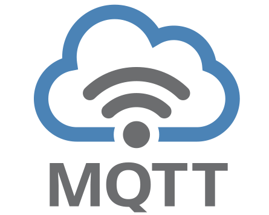

# MqttBridge – User Guide



## Purpose

`MqttBridge` is a shared‑state bridge between two (or more) osysHome instances using MQTT.

The module is designed to:

- publish local object property changes to MQTT in a stable topic format;
- receive inbound MQTT messages and apply them back to local objects (optional);
- allow fine‑grained control over what is exposed via whitelist/blacklist;
- avoid infinite feedback loops between homes;
- provide live connection status and statistics in the admin UI.

---

## What the User Gets

After setup, the module provides:

| Capability | What it does |
| --- | --- |
| Outbound sync | Publishes `changeProperty` updates to MQTT |
| Inbound sync | Subscribes to MQTT topics and calls `setProperty` |
| Topic mapping | Uses a predictable `{prefix}/...` topic structure |
| Filtering | Whitelist + blacklist for classes and objects |
| Loop prevention | Suppresses “echo” updates that came from MQTT |
| Live stats | Shows publishes, inbound updates, caches, filters |

---

## Interface Overview

The admin page is available at:

```text
/admin/MqttBridge
```

Main UI areas:

1. **Top bar**
   - Uptime label.
   - `Settings` button (opens the settings modal).
2. **Stats row**
   - `MQTT Connection` card.
   - `Publishes` card.
   - `Inbound updates` card.
   - `Suppressed echoes` card.
3. **Config summary**
   - Topic prefix, inbound enabled/disabled, broker host/port.
4. **Outbound filter policy**
   - Human‑readable view of whitelist/blacklist configuration.
5. **Settings modal**
   - MQTT connection and outbound filter configuration.

---

## Quick Start Checklist (Two Homes)

- [ ] Make sure both osysHome instances can reach the MQTT broker.
- [ ] On each home, install and enable the `Mqtt` module (for general MQTT usage).
- [ ] On each home, enable the `MqttBridge` plugin.
- [ ] Decide topic prefixes, for example:
  - Home 1: `home1`
  - Home 2: `home2`
- [ ] In the MQTT broker, ensure required credentials and ACLs are configured.
- [ ] In each `MqttBridge` admin page:
  - Set host, port, login, password.
  - Set its own `Topic Prefix` (`home1`, `home2`, …).
  - Configure whitelist/blacklist if you want to limit what is exposed.
  - Decide whether inbound sync should be enabled.

---

## Settings Modal – Fields

### MQTT Connection

| Field | Description |
| --- | --- |
| `Host` | MQTT broker hostname or IP. |
| `Port` | MQTT broker port (typically `1883` or `8883`). |
| `Login` | Username for MQTT authentication (optional if broker is open). |
| `Password` | Password for MQTT authentication. |
| `Topic Prefix` | Logical “home id” placed before all topics, e.g. `home1`. |

### Outbound Filter (Whitelist / Blacklist)

All lists accept comma‑separated or newline‑separated values.

| Field | Description |
| --- | --- |
| `Whitelist Classes` | If non‑empty, only matching classes are allowed to publish. |
| `Whitelist Objects` | If non‑empty, only listed objects are allowed to publish. |
| `Blacklist Classes` | Classes that must never be published (priority over whitelist). |
| `Blacklist Objects` | Objects that must never be published (priority over whitelist). |
| `Enable inbound sync` | If checked, inbound MQTT messages will update properties. |

After you save settings, the plugin reconnects to MQTT and rebuilds caches.

---

## Typical Scenario: Mirror a Property Between Homes

Assume you want to mirror the “guest mode” flag:

- Object: `SystemMode`
- Property: `guest_mode`

### Step 1 – Ensure Object Exists on Both Homes

- On Home 1 and Home 2, create an object `SystemMode` with a boolean property `guest_mode`.

### Step 2 – Configure MqttBridge on Home 1

1. Open `/admin/MqttBridge`.
2. Click `Settings`.
3. Fill in broker connection (host, port, login, password).
4. Set `Topic Prefix` to `home1`.
5. Optionally:
   - Add `SystemMode` to `Whitelist Objects` if you want strict control.
6. Ensure `Enable inbound sync` is **enabled** if you also want to accept updates.
7. Save & reconnect.

When `SystemMode.guest_mode` changes on Home 1, the plugin publishes:

```text
home1/<class_path_if_any>/SystemMode/guest_mode
```

If the object has no class parents, the topic will be:

```text
home1/SystemMode/guest_mode
```

### Step 3 – Configure MqttBridge on Home 2

Repeat the same steps but with:

- `Topic Prefix` = `home2`.

Now:

- Changes on Home 1 are published under `home1/...`.
- Changes on Home 2 are published under `home2/...`.

You can either:

- Subscribe to each other’s prefixes via the generic `Mqtt` module, or
- let `MqttBridge` handle inbound topics if its internal subscriber is enabled and configured.

The internal echo‑suppression logic ensures that updates arriving from MQTT and written to properties are not republished back as new MQTT messages by `MqttBridge`.

---

## Reading the Stats

On the main admin page:

- **MQTT Connection**
  - Badge: `Connected`, `Connecting…`, `Error`, `Disconnected`.
  - “Connected at” timestamp if a session is active.
- **Publishes**
  - Total published messages.
  - Approximate rate (msgs/s).
  - Publish error count.
- **Inbound updates**
  - Total inbound updates applied to properties.
  - Approximate rate (msgs/s).
  - Errors and `setProperty` error count.
- **Suppressed echoes**
  - Total suppressed echo events (to prevent loops).
  - Cache sizes (metadata and object path cache).
  - Sizes of whitelist/blacklist sets.

The **Outbound filter policy** card summarizes:

- Which classes/objects are allowed or denied.
- Whether whitelist mode is effectively active.
- That blacklist always has priority over whitelist.

---

## When to Use MqttBridge vs Plain Mqtt

Use **MqttBridge** when:

- You want a shared‑state model between osysHome instances.
- You prefer a canonical `{prefix}/class_path/object/property` topic mapping.
- You need proxy‑level outbound control and loop prevention.

Use the normal **Mqtt** module when:

- You just need device‑level topics and manual linking to objects.
- You want arbitrary topic structures not matching the shared‑state model.

